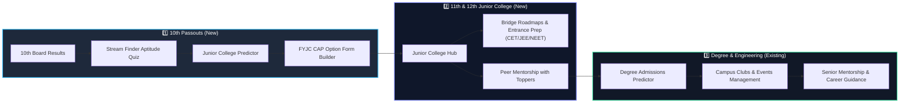
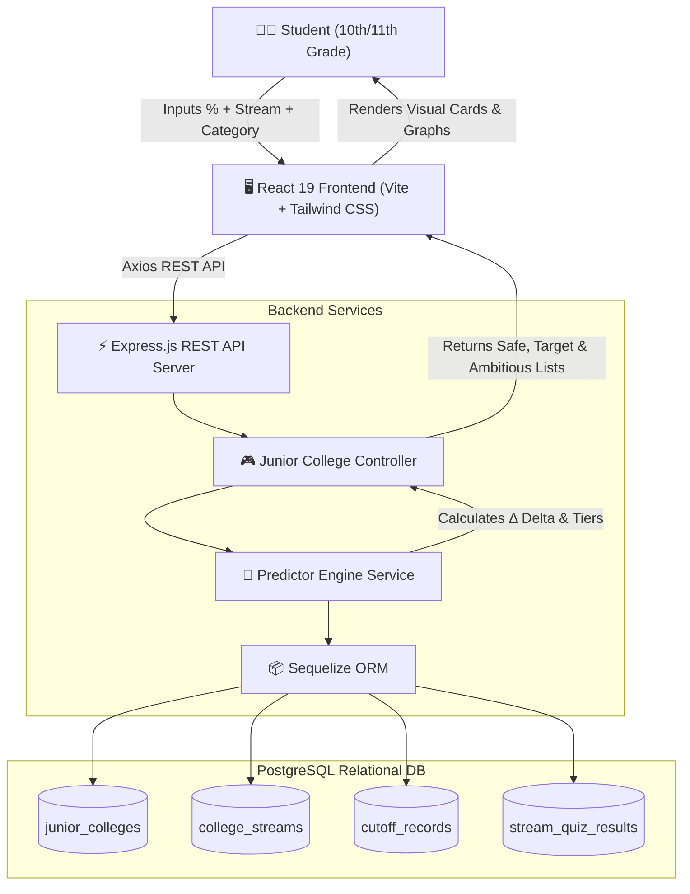
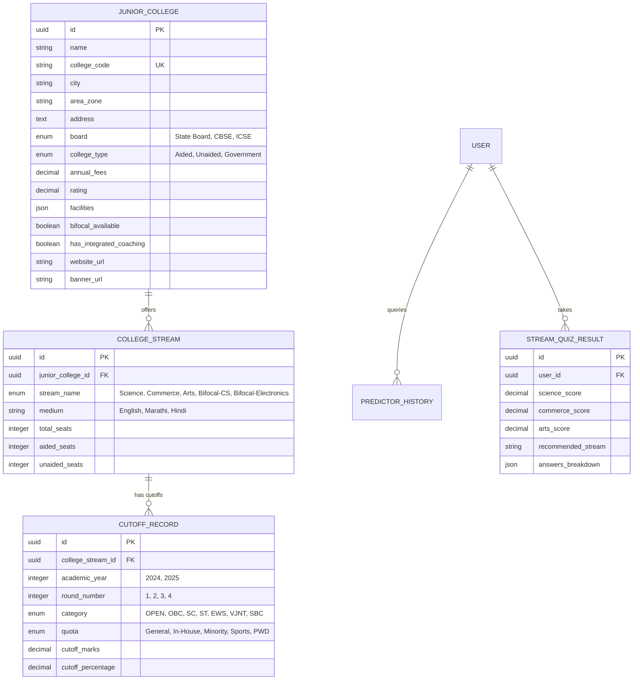
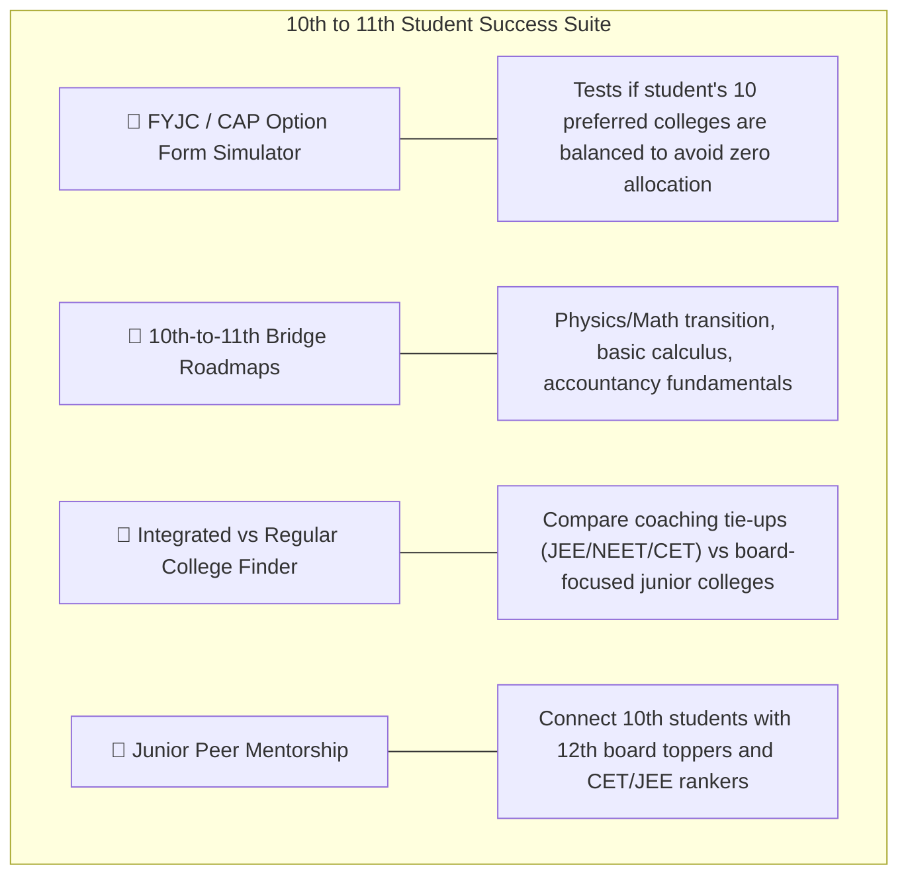

# 🎓 CampusConnect: 10th to 11th Junior College & Predictor Expansion
## 🚀 Comprehensive Technical & Strategic Implementation Plan

> **Document Purpose:**  
> This document serves as the complete technical blueprint and execution roadmap for expanding **CampusConnect** from an engineering-focused campus engagement portal into a multi-stage student ecosystem. This expansion introduces the **10th ➡️ 11th Junior College (FYJC / +2) Admission Predictor**, **Stream Selection Aptitude Test**, and **Junior Academic Hub**.

---

## 📑 Table of Contents
1. [Executive Summary & Strategic Vision](#1-executive-summary--strategic-vision)
2. [End-to-End System Architecture](#2-end-to-end-system-architecture)
3. [Database Schema & Sequelize Models](#3-database-schema--sequelize-models)
4. [Predictor Algorithm & Confidence Engine](#4-predictor-algorithm--confidence-engine)
5. [Backend REST API Specifications](#5-backend-rest-api-specifications)
6. [Frontend UI/UX Architecture & Components](#6-frontend-uiux-architecture--components)
7. [High-Value Feature Modules for 10th & 11th Students](#7-high-value-feature-modules-for-10th--11th-students)
8. [Mock Dataset & Seed Structure](#8-mock-dataset--seed-structure)
9. [Step-by-Step Phased Execution Checklist](#9-step-by-step-phased-execution-checklist)
10. [Long-Term User Retention Strategy](#10-long-term-user-retention-strategy)

---

## 1. Executive Summary & Strategic Vision

Currently, **CampusConnect** empowers enrolled engineering and college students with club recruitments, event management, and senior mentorship. 

Expanding to **10th standard passouts entering 11th grade (Junior College / FYJC / +2)** creates a unified student lifecycle:



### 🎯 Key Benefits:
- **Acquire Users 3–4 Years Earlier:** Students join upon passing 10th grade rather than waiting for college.
- **Zero Churn:** Students transition naturally from Junior College guidance to Degree college engagement.
- **Solves a Massive Pain Point:** Millions of students experience high anxiety navigating cutoff percentages, quota reservations, and stream selections.

---

## 2. End-to-End System Architecture



---

## 3. Database Schema & Sequelize Models

### 🗄️ Relational Entity-Relationship Diagram (ERD)



### 📦 Model Implementations

#### 1. `backend/src/models/JuniorCollege.js`
```javascript
const { DataTypes } = require('sequelize');
const sequelize = require('../config/db');

const JuniorCollege = sequelize.define('JuniorCollege', {
  id: {
    type: DataTypes.UUID,
    defaultValue: DataTypes.UUIDV4,
    primaryKey: true
  },
  name: { type: DataTypes.STRING, allowNull: false },
  college_code: { type: DataTypes.STRING, unique: true }, // e.g. "MU001SGE"
  city: { type: DataTypes.STRING, allowNull: false },      // Mumbai, Pune, etc.
  area_zone: { type: DataTypes.STRING, allowNull: false }, // South Mumbai, Kothrud, etc.
  address: { type: DataTypes.TEXT },
  board: { 
    type: DataTypes.ENUM('State Board', 'CBSE', 'ICSE'), 
    defaultValue: 'State Board' 
  },
  college_type: { 
    type: DataTypes.ENUM('Aided', 'Unaided', 'Government'), 
    defaultValue: 'Aided' 
  },
  annual_fees: { type: DataTypes.DECIMAL(10, 2), defaultValue: 0 },
  rating: { type: DataTypes.DECIMAL(3, 2), defaultValue: 4.5 },
  facilities: { type: DataTypes.ARRAY(DataTypes.STRING), defaultValue: [] },
  bifocal_available: { type: DataTypes.BOOLEAN, defaultValue: false },
  has_integrated_coaching: { type: DataTypes.BOOLEAN, defaultValue: false },
  website_url: { type: DataTypes.STRING },
  banner_url: { type: DataTypes.STRING }
}, {
  tableName: 'junior_colleges',
  timestamps: true,
  underscored: true
});

module.exports = JuniorCollege;
```

#### 2. `backend/src/models/CollegeStream.js`
```javascript
const { DataTypes } = require('sequelize');
const sequelize = require('../config/db');

const CollegeStream = sequelize.define('CollegeStream', {
  id: {
    type: DataTypes.UUID,
    defaultValue: DataTypes.UUIDV4,
    primaryKey: true
  },
  junior_college_id: { type: DataTypes.UUID, allowNull: false },
  stream_name: { 
    type: DataTypes.ENUM('Science', 'Commerce', 'Arts', 'Bifocal Science (CS)', 'Bifocal Science (Electronics)', 'MCVC'),
    allowNull: false
  },
  medium: { type: DataTypes.STRING, defaultValue: 'English' },
  total_seats: { type: DataTypes.INTEGER, defaultValue: 120 },
  aided_seats: { type: DataTypes.INTEGER, defaultValue: 80 },
  unaided_seats: { type: DataTypes.INTEGER, defaultValue: 40 }
}, {
  tableName: 'college_streams',
  timestamps: true,
  underscored: true
});

module.exports = CollegeStream;
```

#### 3. `backend/src/models/CutoffRecord.js`
```javascript
const { DataTypes } = require('sequelize');
const sequelize = require('../config/db');

const CutoffRecord = sequelize.define('CutoffRecord', {
  id: {
    type: DataTypes.UUID,
    defaultValue: DataTypes.UUIDV4,
    primaryKey: true
  },
  college_stream_id: { type: DataTypes.UUID, allowNull: false },
  academic_year: { type: DataTypes.INTEGER, allowNull: false },
  round_number: { type: DataTypes.INTEGER, allowNull: false }, // 1, 2, 3, or Special Round
  category: { 
    type: DataTypes.ENUM('OPEN', 'OBC', 'SC', 'ST', 'EWS', 'VJNT', 'SBC'),
    defaultValue: 'OPEN'
  },
  quota: { 
    type: DataTypes.ENUM('General', 'In-House', 'Minority', 'Sports', 'PWD'),
    defaultValue: 'General'
  },
  cutoff_marks: { type: DataTypes.DECIMAL(6, 2) },
  cutoff_percentage: { type: DataTypes.DECIMAL(5, 2), allowNull: false }
}, {
  tableName: 'cutoff_records',
  timestamps: true,
  underscored: true
});

module.exports = CutoffRecord;
```

---

## 4. Predictor Algorithm & Confidence Engine

### 🧮 Mathematical Formula

The algorithm evaluates the **Delta ($\Delta$)** between the student's 10th score and the latest historical round cutoff:

$$\Delta = \text{Student Percentage} - \text{Historical Cutoff Percentage}$$

$$\text{Admission Confidence Score (\%)} = \min\left(99, \max\left(5, \text{round}\left(50 + (\Delta \times 10)\right)\right)\right)$$

### 🎯 Tiers of Admission:
| Tier | Delta Range ($\Delta$) | Admission Chance | Badge & Styling |
| :--- | :--- | :--- | :--- |
| **🟢 Safe** | $\Delta \ge +2.0\%$ | **90% – 99%** | `bg-emerald-500/10 text-emerald-400 border-emerald-500/20` |
| **🟡 Target** | $-2.0\% \le \Delta < +2.0\%$ | **50% – 89%** | `bg-amber-500/10 text-amber-400 border-amber-500/20` |
| **🔴 Ambitious (Dream)** | $-5.0\% \le \Delta < -2.0\%$ | **10% – 49%** | `bg-rose-500/10 text-rose-400 border-rose-500/20` |

### 🛠️ Service Implementation: `backend/src/services/predictor.service.js`
```javascript
const { JuniorCollege, CollegeStream, CutoffRecord } = require('../models');
const { Op } = require('sequelize');

exports.calculatePredictions = async ({
  percentage,
  stream,
  category = 'OPEN',
  quota = 'General',
  city,
  maxFees,
  bifocalOnly = false
}) => {
  const parsedPercentage = parseFloat(percentage);

  const collegeFilter = {};
  if (city) collegeFilter.city = { [Op.iLike]: `%${city}%` };
  if (maxFees) collegeFilter.annual_fees = { [Op.lte]: parseFloat(maxFees) };
  if (bifocalOnly) collegeFilter.bifocal_available = true;

  const streamFilter = {};
  if (stream) streamFilter.stream_name = stream;

  const streams = await CollegeStream.findAll({
    where: streamFilter,
    include: [
      {
        model: JuniorCollege,
        where: collegeFilter,
        attributes: [
          'id', 'name', 'college_code', 'city', 'area_zone', 'board',
          'college_type', 'annual_fees', 'rating', 'facilities', 'banner_url'
        ]
      },
      {
        model: CutoffRecord,
        where: {
          category: category,
          quota: quota,
          round_number: 1 // Match baseline with Round 1 cutoffs
        },
        required: true
      }
    ]
  });

  const results = {
    safe: [],
    target: [],
    ambitious: [],
    summary: { totalFound: 0, safeCount: 0, targetCount: 0, ambitiousCount: 0 }
  };

  streams.forEach((item) => {
    const cutoff = item.CutoffRecords[0];
    if (!cutoff) return;

    const lastCutoff = parseFloat(cutoff.cutoff_percentage);
    const delta = parseFloat((parsedPercentage - lastCutoff).toFixed(2));
    let chance = Math.min(99, Math.max(5, Math.round(50 + (delta * 10))));

    const collegeData = {
      collegeId: item.JuniorCollege.id,
      name: item.JuniorCollege.name,
      code: item.JuniorCollege.college_code,
      city: item.JuniorCollege.city,
      area: item.JuniorCollege.area_zone,
      board: item.JuniorCollege.board,
      type: item.JuniorCollege.college_type,
      fees: item.JuniorCollege.annual_fees,
      rating: item.JuniorCollege.rating,
      facilities: item.JuniorCollege.facilities,
      stream: item.stream_name,
      totalSeats: item.total_seats,
      cutoffPercentage: lastCutoff,
      delta: delta,
      chance: chance
    };

    if (delta >= 2.0) {
      results.safe.push({ ...collegeData, categoryTier: 'Safe' });
    } else if (delta >= -2.0) {
      results.target.push({ ...collegeData, categoryTier: 'Target' });
    } else if (delta >= -5.0) {
      results.ambitious.push({ ...collegeData, categoryTier: 'Ambitious' });
    }
  });

  // Sort descending by probability
  results.safe.sort((a, b) => b.chance - a.chance);
  results.target.sort((a, b) => b.chance - a.chance);
  results.ambitious.sort((a, b) => b.chance - a.chance);

  results.summary.safeCount = results.safe.length;
  results.summary.targetCount = results.target.length;
  results.summary.ambitiousCount = results.ambitious.length;
  results.summary.totalFound = results.safe.length + results.target.length + results.ambitious.length;

  return results;
};
```

---

## 5. Backend REST API Specifications

| Method | Endpoint | Access | Description |
| :--- | :--- | :--- | :--- |
| `POST` | `/api/junior-college/predict` | Public | Calculate college admissions tiers based on 10th score, stream, category, and city. |
| `GET` | `/api/junior-college/colleges` | Public | Paginated list of junior colleges with city, board, and fee filters. |
| `GET` | `/api/junior-college/colleges/:id` | Public | Full college details with all streams and Round 1, 2, 3 cutoffs. |
| `POST` | `/api/junior-college/stream-quiz/submit` | Authenticated | Submit 15-question aptitude quiz answers and get suitability breakdown. |
| `GET` | `/api/junior-college/stream-quiz/my-results` | Authenticated | Fetch past stream quiz results for the student. |
| `GET` | `/api/junior-college/cap-timeline` | Public | Fetch centralized admission schedule, rounds, and guidelines. |

---

## 6. Frontend UI/UX Architecture & Components

### 🖥️ Pages to Create:

1. **`JuniorCollegePredictor.jsx` (Route: `/junior-college/predict`)**
   - **Hero Section:** Engaging headline and quick statistics.
   - **Form Card:** Interactive sliders for percentage, category dropdown, stream toggle buttons, city autocomplete.
   - **Results Tabs:** Categorized tabs for **🟢 Safe Choices**, **🟡 Target Choices**, and **🔴 Dream Choices**.
   - **Action Tools:** Download Shortlist PDF, share with parents via WhatsApp, compare 2 colleges side-by-side.

2. **`JuniorCollegeDetails.jsx` (Route: `/junior-college/:id`)**
   - Detailed banner, contact info, and address map.
   - Interactive table of Round 1, Round 2, Round 3 cutoff percentages for General, OBC, SC, ST, EWS.
   - List of bifocal subjects, lab facilities, and sports grounds.

3. **`StreamQuiz.jsx` (Route: `/stream-quiz`)**
   - 15-question aptitude quiz with a dynamic progress bar.
   - Radar chart visualizing aptitude across **Science**, **Commerce**, and **Arts**.
   - Direct CTA button: *"Find Junior Colleges for my recommended stream ➡️"*.

---

## 7. High-Value Feature Modules for 10th & 11th Students



1. **FYJC / CAP Option Form Simulator:**
   - Students drag and drop 10 college preferences.
   - The engine validates if the list contains at least 3 Safe choices to prevent getting rejected in Round 1.
2. **Integrated vs Regular Junior College Comparison:**
   - Filters colleges with integrated coaching (Allen, FIITJEE, Chate, etc.) vs attendance-mandatory institutions.
3. **10th-to-11th Summer Bridge Roadmap:**
   - Step-by-step preparation guides for trigonometry, calculus fundamentals, physics vectors, and commerce journal entries.
4. **Peer Mentors for Junior College:**
   - Enable 11th/12th toppers in the existing `Mentors.jsx` portal to answer queries on stream difficulty and study schedules.

---

## 8. Mock Dataset & Seed Structure

Create a seed script `backend/src/utils/seedJuniorColleges.js` with realistic datasets:

### Top Colleges Sample:
- **Mumbai:**
  - *St. Xavier's Junior College* (Science: 94.20%, Arts: 92.40%)
  - *D.G. Ruparel College* (Science: 91.80%, Bifocal CS: 94.60%)
  - *Mithibai College* (Commerce: 90.60%, Arts: 87.20%)
  - *R.A. Podar College of Commerce* (Commerce: 92.80%)
  - *Jai Hind College* (Commerce: 91.40%, Science: 89.20%)
- **Pune:**
  - *Fergusson Junior College* (Science: 95.00%, Arts: 93.60%)
  - *Brihan Maharashtra College of Commerce (BMCC)* (Commerce: 93.40%)
  - *Sir Parashurambhau (SP) College* (Science: 90.20%, Commerce: 88.50%)
  - *Modern Junior College, Shivajinagar* (Science: 86.40%, Bifocal: 89.00%)

---

## 9. Step-by-Step Phased Execution Checklist

### Phase 1: Database & Seed Layer
- [ ] Create `backend/src/models/JuniorCollege.js`
- [ ] Create `backend/src/models/CollegeStream.js`
- [ ] Create `backend/src/models/CutoffRecord.js`
- [ ] Update associations in `backend/src/models/index.js`
- [ ] Build and execute `backend/src/utils/seedJuniorColleges.js`

### Phase 2: Predictor Backend API
- [ ] Implement `backend/src/services/predictor.service.js`
- [ ] Create `backend/src/controllers/juniorCollege.controller.js`
- [ ] Define routes in `backend/src/routes/juniorCollege.routes.js`
- [ ] Mount `/api/junior-college` in `backend/src/app.js`

### Phase 3: Frontend User Interface
- [ ] Build `frontend/src/pages/JuniorCollegePredictor.jsx`
- [ ] Build `frontend/src/pages/JuniorCollegeDetails.jsx`
- [ ] Build `frontend/src/pages/StreamQuiz.jsx`
- [ ] Update `frontend/src/App.jsx` with new routes
- [ ] Update `frontend/src/components/Navbar.jsx` with navigation links

### Phase 4: Quality Assurance & Launch
- [ ] Test predictor delta calculations for all edge score values (35% to 100%)
- [ ] Verify reservation categories (OPEN, OBC, SC, ST, EWS) and quotas
- [ ] Ensure mobile responsive layout across all screen sizes

---

## 10. Long-Term User Retention Strategy

```text
┌─────────────────────────────────────────────────────────────────────────┐
│                           STUDENT JOURNEY                               │
├───────────────────┬─────────────────────────────────┬───────────────────┤
│    10th Grade     │       11th & 12th Grade         │ Degree / College  │
├───────────────────┼─────────────────────────────────┼───────────────────┤
│ • Stream Quiz     │ • Bridge Roadmaps               │ • Campus Clubs    │
│ • JC Predictor    │ • CET / JEE Exam Trackers       │ • Event RSVPs     │
│ • CAP Simulator   │ • Junior Peer Mentorship        │ • Career Mentors  │
└───────────────────┴─────────────────────────────────┴───────────────────┘
```

1. **Email & Notification Engagement:** Keep 10th passouts informed about official CAP round seat allocation announcements.
2. **Bridge to Senior Portal:** Once students finish 12th, automatically upgrade their accounts to the Degree College & Engineering portal with zero friction.
3. **Monetization Potential:** Partner with private junior colleges and coaching institutes for featured banners and counseling sessions.

---

*Created for CampusConnect — Empowering Students Across Every Step of Their Academic Journey.*
