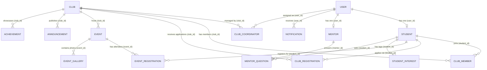

# 🎓 CampusConnect (Campus Compass) — Comprehensive Project Overview

> **Note for ChatGPT / AI Assistant:**  
> This document contains the complete technical and functional blueprint of **CampusConnect** (also referred to as *Campus Compass*). Read this document to understand the application's architecture, database schema, REST APIs, frontend components, business logic, and workflows to answer any questions or explain concepts to the user in simple or technical terms.

---

## 📌 1. Project Summary & Purpose

**CampusConnect** is a modern, full-stack campus engagement and club management platform built for colleges and universities. It bridges the gap between college administration, student clubs/societies, senior mentors, and freshmen/students.

### 🎯 Key Problems Solved:
1. **Fragmented Communication:** Replaces scattered WhatsApp groups, bulletin boards, and Google Forms with a centralized, unified campus portal.
2. **Club Recruitment Chaos:** Provides clubs with a streamlined applicant screening system (applications, statement of purpose, skill sets, status updates: pending/approved/rejected/waitlisted).
3. **Freshman Guidance & Mentorship:** Offers a curated freshman roadmap, mentorship directory with a Q&A portal, and searchable FAQs.
4. **Event Management & RSVP:** Centralizes college event schedules, tracks participant limits and deadlines, and logs registrations.
5. **Real-time Campus Updates:** Pushes instant notifications to students via WebSockets and automated background maintenance via scheduled cron jobs.

---

## 🛠️ 2. Technology Stack

### **Frontend (Client-Side)**
- **Framework:** React 19 (Vite build tool)
- **Routing:** React Router DOM v7
- **Styling & Design:** Tailwind CSS v4, Glassmorphism design system, Space Grotesk / Inter typography
- **Animations:** Framer Motion (smooth page transitions, modal fades, animated stat counters)
- **Icons:** Lucide React
- **State & Context:** React Context API (`AuthContext`, `SocketContext`)
- **HTTP Client:** Axios (configured with interceptors for JWT bearer tokens)
- **Real-time Client:** Socket.IO Client

### **Backend (Server-Side)**
- **Runtime & Framework:** Node.js, Express.js
- **Database:** PostgreSQL (Relational Database)
- **ORM:** Sequelize ORM (Object-Relational Mapping with migrations and relationships)
- **Real-time Engine:** Socket.IO Server (rooms for user-specific & broadcast notifications)
- **Task Scheduling:** `node-cron` (daily midnight cron job to auto-close expired club registrations)
- **Authentication & Security:** JWT (JSON Web Tokens), `bcryptjs` password hashing, crypto token hashing
- **Email Service:** Brevo (formerly Sendinblue) Transactional REST API for password reset emails
- **File Uploads:** Multer (multipart form handling for images/posters)

---

## 👥 3. User Roles & Access Control

The platform enforces **Role-Based Access Control (RBAC)** across three distinct primary roles:

| Role | Access Permissions & Responsibilities |
| :--- | :--- |
| **Student** | • Browse clubs, view event schedules, and access freshman roadmap & FAQs.<br>• Fill out club applications with SOP, skills, and experience.<br>• RSVP to campus events.<br>• Ask questions to verified senior mentors.<br>• Access personal Student Dashboard (interest matching, application statuses, notifications). |
| **Club Coordinator** | • Manage designated club profile and announcements.<br>• Review club applications (approve, reject, waitlist applicants).<br>• Schedule and publish new events and workshops.<br>• Post club-specific broadcasts and updates. |
| **Admin** | • High-level dashboard overview (total students, active clubs, registrations, trends).<br>• Create, update, or delete clubs.<br>• Assign / elevate students to Coordinator roles.<br>• View student directory and system analytics. |
| **Mentor** *(Special Profile)* | • Profile listed in Mentors directory with department, domain skills, and past clubs.<br>• Answer questions submitted by junior students. |

---

## 🗄️ 4. Database Schema & Data Models

CampusConnect uses PostgreSQL with Sequelize ORM. The relational structure is designed with clear foreign key constraints and cascading behavior:



### Key Models & Fields:

1. **User (`User.js`):** `id`, `name`, `email`, `password_hash`, `role` (`student`, `coordinator`, `admin`), `status` (`active`, `inactive`), `reset_token`, `reset_token_expires`.
2. **Student (`Student.js`):** `id`, `user_id`, `student_id_card`, `department`, `year` (1-4), `division`, `bio`, `skills`, `availability`.
3. **StudentInterest (`StudentInterest.js`):** `id`, `student_id`, `interest` (e.g. `AI / ML`, `Web Dev`, `Robotics`, `Design`, `Music`).
4. **Club (`Club.js`):** `id`, `name`, `category` (`technical`, `cultural`, `sports`, `social`), `description`, `about`, `activities`, `logo_url`, `banner_url`, `registration_status` (`open`, `closed`), `registration_start`, `registration_end`, `eligibility`, `beginners_allowed`.
5. **ClubCoordinator (`ClubCoordinator.js`):** `id`, `user_id`, `club_id`, `role_title` (e.g. *Lead Coordinator*, *Tech Lead*).
6. **ClubRegistration (`ClubRegistration.js`):** `id`, `student_id`, `club_id`, `skills`, `experience`, `statement_of_purpose`, `availability`, `status` (`pending`, `approved`, `rejected`, `waitlisted`), `applied_date`.
7. **ClubMember (`ClubMember.js`):** `id`, `student_id`, `club_id`, `role` (`member`, `core_member`, `lead`), `joined_date`.
8. **Event (`Event.js`):** `id`, `club_id`, `title`, `description`, `venue`, `event_date`, `registration_deadline`, `max_participants`, `banner_url`, `rules`, `eligibility`, `prizes`.
9. **EventRegistration (`EventRegistration.js`):** `id`, `student_id`, `event_id`, `registration_date`, `status` (`registered`, `attended`, `cancelled`).
10. **Mentor (`Mentor.js`):** `id`, `user_id`, `department`, `year`, `bio`, `skills`, `interests`, `clubs`, `avatar_url`, `linkedin_url`, `github_url`.
11. **MentorQuestion (`MentorQuestion.js`):** `id`, `student_id`, `mentor_id`, `question`, `answer`, `asked_at`, `answered_at`.
12. **Announcement (`Announcement.js`):** `id`, `club_id`, `title`, `content`, `category` (`general`, `club`, `event`, `urgent`), `is_important`.
13. **Notification (`Notification.js`):** `id`, `user_id`, `title`, `message`, `type` (`club_status`, `event_reminder`, `general`, `mentor_answer`), `is_read`.
14. **FAQ (`FAQ.js`):** `id`, `question`, `answer`, `category`.
15. **Achievement (`Achievement.js`) & EventGallery (`EventGallery.js`):** Club awards, milestone records, and past event photos.

---

## 🌐 5. Backend REST API Endpoints

### 🔐 Authentication (`/api/auth`)
- `POST /api/auth/register` — Register a student with college details & selected interests.
- `POST /api/auth/login` — Authenticate and receive JWT token + user profile.
- `GET /api/auth/me` — Retrieve currently logged-in user profile (with student interests).
- `PUT /api/auth/me` — Update student bio, skills, and availability.
- `POST /api/auth/forgot-password` — Send a password reset email via Brevo with a 1-hour secure token.
- `POST /api/auth/reset-password/:token` — Validate crypto hash and update password.

### 🏛️ Clubs (`/api/clubs`)
- `GET /api/clubs` — List clubs (supports search, category filter, registration status filter, pagination).
- `GET /api/clubs/:id` — Detailed club profile with coordinators, members, announcements, events, and achievements.
- `POST /api/clubs/:id/register` — Submit a club membership application.
- `GET /api/clubs/registrations` — Get all club applications submitted by the logged-in student.

### 📅 Events (`/api/events`)
- `GET /api/events` — Get events (filter by `upcoming`, `this_week`, `this_month`, `completed`, search query).
- `GET /api/events/:id` — Single event details, rules, prizes, and gallery photos.
- `POST /api/events/:id/register` — RSVP to an event (checks participant caps and deadlines).
- `GET /api/events/my-events` — Get all events the logged-in student has registered for.

### 🎓 Mentorship (`/api/mentors`)
- `GET /api/mentors` — Search and filter verified senior mentors by department or skill.
- `POST /api/mentors/:id/questions` — Submit a question to a mentor.
- `GET /api/mentors/:id/questions` — Get Q&A conversation thread for a mentor.
- `PUT /api/mentors/questions/:qId/answer` — Answer a student's question (Mentor only).

### 🔔 Notifications & Announcements (`/api/notifications`, `/api/announcements`)
- `GET /api/notifications` — Fetch user notifications.
- `PUT /api/notifications/:id/read` — Mark notification as read.
- `PUT /api/notifications/read-all` — Mark all notifications as read.
- `GET /api/announcements` — Get active announcements.

### 🛡️ Coordinator Portal (`/api/coordinator`)
- `GET /api/coordinator/my-club` — Retrieve managed club data, member roster, events, and announcements.
- `GET /api/coordinator/clubs/:clubId/applicants` — View all pending/reviewed club applicants.
- `PUT /api/coordinator/applications/:registrationId` — Update application status (`approved` adds applicant to `ClubMember`; `rejected`/`waitlisted` removes them).
- `POST /api/coordinator/clubs/:clubId/events` — Create and schedule a new club event.
- `POST /api/coordinator/clubs/:clubId/announcements` — Publish a club announcement.

### ⚙️ Admin Console (`/api/admin`)
- `GET /api/admin/dashboard` — Metric counters, 30-day student signup trend analytics, and top clubs by membership.
- `POST /api/admin/assign-coordinator` — Grant coordinator role to a user for a specific club.
- `GET /api/admin/students` — Paginated student directory.
- `POST /api/admin/clubs` — Create a new club profile.
- `PUT /api/admin/clubs/:id` — Update club info.
- `DELETE /api/admin/clubs/:id` — Delete a club.

---

## 💻 6. Frontend Architecture & Page Directory

The frontend is structured in `frontend/src/` with clear modularity:

```
frontend/src/
├── components/
│   ├── Navbar.jsx          # Dynamic navigation with role badges, notifications dropdown, mobile drawer
│   ├── Footer.jsx          # Campus links, quick exploration, newsletter, copyright
│   └── ProtectedRoute.jsx  # Route guard checking JWT auth state and allowed roles
├── context/
│   ├── AuthContext.jsx     # Global user state, login, logout, token persistence in localStorage
│   └── SocketContext.jsx   # Live WebSocket connection, rooms subscription, toast alerts
├── pages/
│   ├── Home.jsx            # Hero banner, feature highlights, live statistics, quick links
│   ├── Login.jsx           # Sign in form + demo credential quick-fill buttons
│   ├── Register.jsx        # Multi-step student onboarding (academic details + interest tags)
│   ├── ResetPassword.jsx   # Token-based password update UI
│   ├── ExploreClubs.jsx    # Searchable & filterable grid of all campus clubs
│   ├── ClubDetails.jsx     # Deep dive into club history, team, events, and application modal
│   ├── Events.jsx          # Filterable event tabs (This Week, This Month, Upcoming, Past)
│   ├── EventDetails.jsx    # Event rules, prizes, organizer club info, RSVP button
│   ├── Roadmap.jsx         # Freshman 6-Phase interactive milestone blueprint
│   ├── FAQ.jsx             # Category-based accordion with common college queries
│   ├── Mentors.jsx         # Mentor cards, filter by department, interactive Q&A dialog
│   ├── Profile.jsx         # Student profile viewer & editable bio/skills/availability
│   ├── StudentDashboard.jsx# Smart club recommendations algorithm, application tracking, notifications
│   ├── CoordinatorDashboard.jsx # Applicant screening actions, event creation form, announcements
│   └── AdminDashboard.jsx  # Analytics trends, student directory, coordinator assigner, club CRUD
└── services/
    └── api.js              # Axios instance configured with baseURL and auth token interceptor
```

---

## ⚡ 7. Key Algorithms & Notable Workflows

### 🧠 1. Intelligent Student-Club Matching Algorithm
Located in `StudentDashboard.jsx`:
- Takes the logged-in student's saved interest tags (`StudentInterests`).
- Iterates over all active clubs and evaluates keyword matches across `club.name` (+35%), `club.description` (+20%), and `club.category` (+15%) on top of a 40% base compatibility.
- Caps the score at 98% and sorts descending to display personalized **"Top Recommended Clubs for You"**.

### 🔄 2. Real-time Notifications via Socket.IO
- When a user logs in, `SocketContext.jsx` connects to the backend and emits a `join` event with the `userId`.
- The backend places the socket into a dedicated room (`socket.join(userId)`).
- When events occur (e.g. coordinator approves an application, mentor answers a question), `sendNotificationToUser(userId, data)` triggers an immediate UI notification without page refresh.

### ⏰ 3. Daily Midnight Cron Job
Located in `backend/src/jobs/cron.jobs.js`:
- Uses `node-cron` scheduled at `0 0 * * *` (midnight every day).
- Checks all clubs where `registration_status === 'open'` and `registration_end < new Date()`.
- Automatically flips their status to `closed` to maintain database hygiene.

### 🔑 4. Secure Password Reset Flow
1. User enters email at `/login` (Forgot Password).
2. Backend generates a 32-byte cryptographic random token, stores its SHA-256 hash in `User.reset_token` with a 1-hour expiration timestamp.
3. Backend calls Brevo's HTTPS API to dispatch a branded HTML email containing `http://localhost:5173/reset-password/<raw_token>`.
4. User clicks the link, inputs new password, backend compares SHA-256 hash, updates `password_hash` with bcrypt, and invalidates the token.

---

## 🚀 8. How to Run the Project Locally

### Prerequisites:
- Node.js (v18+)
- PostgreSQL installed and running (default port `5432`)

### 1. Backend Setup:
```bash
cd backend
npm install
```
Configure `.env` file in `backend/`:
```env
PORT=5000
DB_HOST=localhost
DB_PORT=5432
DB_NAME=campus_compass
DB_USER=postgres
DB_PASSWORD=your_postgres_password
JWT_SECRET=supersecretcampuscompasskey12345
BREVO_API_KEY=your_brevo_api_key_here
BREVO_SENDER_EMAIL=support@campuscompass.edu
```
Seed the database with complete mock data (students, clubs, mentors, events, announcements):
```bash
npm run seed
```
Start the backend server:
```bash
npm run dev
# Server runs at http://localhost:5000
```

### 2. Frontend Setup:
```bash
cd ../frontend
npm install
npm run dev
# Vite runs at http://localhost:5173
```

---

## 🤖 9. Suggested Prompt for ChatGPT

When sharing this file with ChatGPT, you can copy-paste the text below into your prompt:

```text
Hi ChatGPT! I am sharing the complete technical overview of my project, "CampusConnect (Campus Compass)".
Please read the attached project overview document. Once you have read it:
1. Give me a beginner-friendly summary of what this project is and why it's useful.
2. Explain the main components of the backend and frontend architecture.
3. Explain the flow of how a student applies to a club and how a coordinator approves them.
4. Tell me the top 5 questions an examiner or interviewer might ask about this project, along with strong answers.
```
