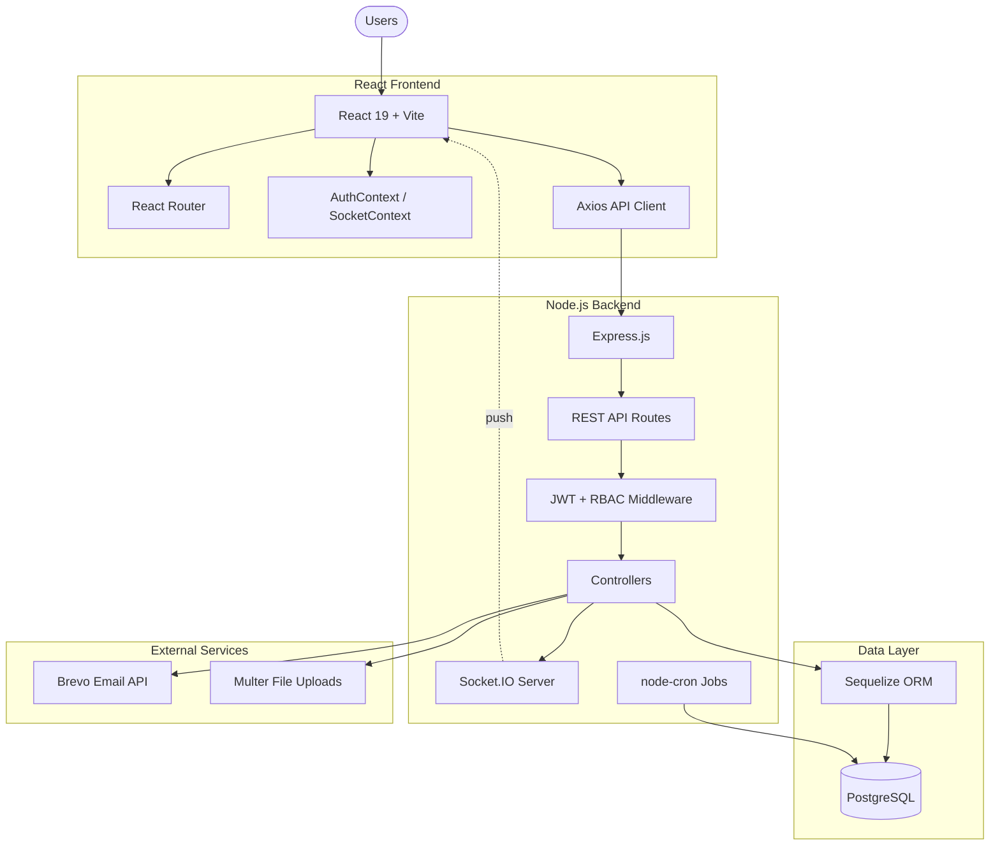
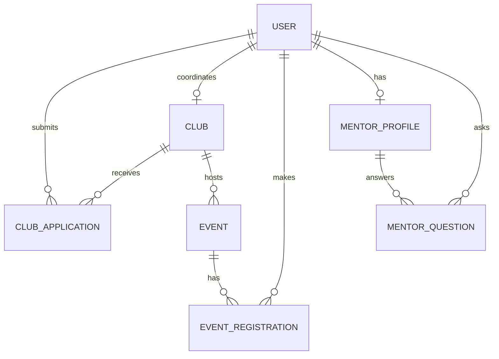
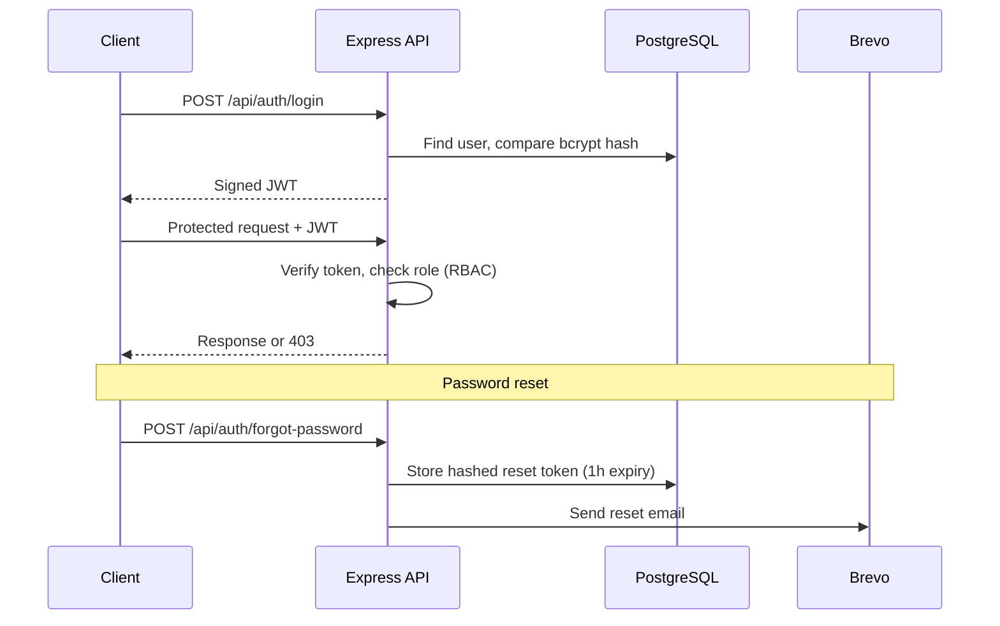
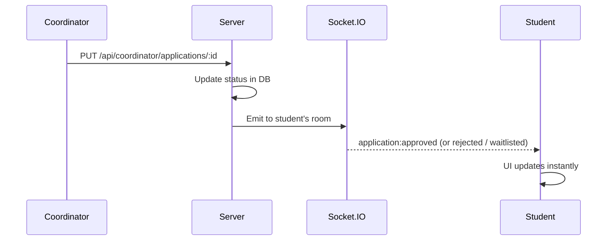

<div align="center">

# 🎓 CampusConnect

**One platform for club recruitment, events, and student mentorship.**


<!-- TODO: add your live demo link, e.g. **[Live Demo](https://your-app.vercel.app)** · **[Demo Video](https://...)** -->

</div>

---

## 📌 Overview

CampusConnect (also called *Campus Compass*) is a full-stack web app that brings students, club coordinators, mentors, and administrators into one system. It replaces the usual mix of WhatsApp groups, notice boards, and Google Forms with a single portal.

<!-- TODO: add 2-3 screenshots or a GIF here. Recruiters look at these first.
<p align="center"></p>
-->

## 🎯 Problem It Solves

| Problem | Traditional approach | CampusConnect |
|---|---|---|
| Club discovery | WhatsApp / word of mouth | Centralized club directory with smart matching |
| Club recruitment | Google Forms | Built-in applications with status tracking |
| Application tracking | Manual spreadsheets | Personal student dashboard |
| Event registration | Separate forms | Integrated RSVP with capacity and deadlines |
| Freshman guidance | Informal senior advice | 6-phase milestone roadmap |
| Student questions | Random group messages | Mentor Q&A threads |
| Notifications | Manual messages | Real-time updates via WebSockets |
| Registration expiry | Manual checking | Automated nightly cron job |

## ✨ Key Features

- **Secure authentication:** JWT, bcryptjs password hashing, and a password-reset flow with cryptographically generated tokens that expire in 1 hour, delivered by email through Brevo.
- **Role-based access control (RBAC):** four roles (Student, Coordinator, Mentor, Admin) enforced by backend middleware and frontend protected routes.
- **Club application workflow:** students apply with a statement of purpose and skills; coordinators approve, reject, or waitlist; approved students join the club roster automatically.
- **Smart club matching:** a rule-based recommender scores clubs against a student's interests.
- **Event management and RSVP:** descriptions, deadlines, capacity, rules, banner uploads, participant tracking, and photo galleries.
- **Real-time notifications:** user-specific Socket.IO rooms push approvals, waitlist updates, event alerts, and mentor answers without a page refresh.
- **Automated background jobs:** a `node-cron` job runs at midnight to close expired club registration windows.
- **Mentorship:** browse verified mentors (skills, department, past clubs), ask questions, and read answers in Q&A threads.
- **Admin dashboard:** campus analytics, signup trends, club management, and coordinator assignment.

### Club matching weights

| Signal | Weight |
|---|---|
| Club name match | +35% |
| Description match | +20% |
| Category match | +15% |
| Interest / domain compatibility | Context-based |

## 🏗️ System Architecture



### Data relationships



### Roles and permissions

| Capability | Student | Coordinator | Mentor | Admin |
|---|:-:|:-:|:-:|:-:|
| Browse clubs, events, mentors | ✅ | ✅ | ✅ | ✅ |
| Apply to clubs / register for events | ✅ | | | |
| Ask a mentor a question | ✅ | | | |
| Answer questions | | | ✅ | |
| Review applications, create events | | ✅ | | |
| Analytics dashboard, assign coordinators | | | | ✅ |

## 🔐 Authentication Flow



## ⚡ Real-Time Notifications

Each user joins a private Socket.IO room, so the server can push events to exactly one person.



**Events:** `application:approved` · `application:rejected` · `application:waitlisted` · `event:reminder` · `mentor:answer`

## 🌐 REST API Reference

| Area | Method | Endpoint | Description |
|---|---|---|---|
| Auth | POST | `/api/auth/register` | Register a new user |
| Auth | POST | `/api/auth/login` | Log in |
| Auth | POST | `/api/auth/forgot-password` | Request password reset |
| Clubs | GET | `/api/clubs` | List all clubs |
| Clubs | GET | `/api/clubs/:id` | Club details |
| Clubs | POST | `/api/clubs/:id/register` | Apply to a club |
| Events | GET | `/api/events` | List events |
| Events | POST | `/api/events/:id/register` | Register for an event |
| Events | GET | `/api/events/my-events` | My registered events |
| Mentors | GET | `/api/mentors` | List mentors |
| Mentors | POST | `/api/mentors/:id/questions` | Ask a question |
| Mentors | PUT | `/api/mentors/questions/:qId/answer` | Answer a question |
| Coordinator | GET | `/api/coordinator/my-club` | Coordinator's club |
| Coordinator | PUT | `/api/coordinator/applications/:id` | Update application status |
| Admin | GET | `/api/admin/dashboard` | Campus analytics |
| Admin | POST | `/api/admin/assign-coordinator` | Assign a coordinator |

## 📁 Project Structure

```
CampusConnect/
├── backend/
│   └── src/
│       ├── config/        # Database & environment config
│       ├── controllers/   # Auth, clubs, events, mentors, admin logic
│       ├── jobs/          # node-cron background jobs
│       ├── middleware/    # Authentication & role guards
│       ├── models/        # Sequelize models
│       ├── routes/        # REST API routes
│       ├── sockets/       # Socket.IO handlers
│       └── utils/         # Seeders & helpers
└── frontend/
    └── src/
        ├── components/    # Navbar, Footer, ProtectedRoute, ...
        ├── context/       # AuthContext, SocketContext
        ├── pages/         # Home, Clubs, Dashboard, Mentors, Roadmap, ...
        └── services/      # Axios API client
```

## 🚀 Getting Started

**Prerequisites:** Node.js v18+, PostgreSQL, npm, Git.

```bash
# 1. Clone
git clone https://github.com/Yashraj-0910/CampusConnect.git
cd CampusConnect

# 2. Backend
cd backend
npm install
```

Create `backend/.env`:

```env
PORT=5000
DB_HOST=localhost
DB_PORT=5432
DB_NAME=campus_compass
DB_USER=postgres
DB_PASSWORD=your_password
JWT_SECRET=your_jwt_secret
BREVO_API_KEY=your_brevo_api_key
```

```bash
npm run seed    # seed the database
npm run dev     # API on http://localhost:5000

# 3. Frontend (new terminal)
cd frontend
npm install
npm run dev     # app on http://localhost:5173
```

> ⚠️ Never commit `.env`. Keep it in `.gitignore`.

| Variable | Description |
|---|---|
| `PORT` | Backend port |
| `DB_HOST` / `DB_PORT` / `DB_NAME` | PostgreSQL connection |
| `DB_USER` / `DB_PASSWORD` | PostgreSQL credentials |
| `JWT_SECRET` | Secret used to sign JWTs |
| `BREVO_API_KEY` | Brevo key for transactional email |

## 💡 Design Decisions

- **PostgreSQL + Sequelize:** the data is highly relational (users, clubs, applications, events, registrations, mentors, questions), so strong consistency and a clear model layer fit better than a document store.
- **Socket.IO over polling:** the server pushes changes to connected clients instead of every client repeatedly asking whether something changed.
- **JWT:** stateless auth that suits REST APIs and role checks in middleware.
- **node-cron:** maintenance such as closing expired registrations should happen automatically, not depend on a user action.
- **Layered structure:** routes → middleware → controllers → models on the backend, and components → pages → context → services on the frontend, so each layer can be tested and extended independently.

## 🔮 Roadmap

- [ ] Docker containerization
- [ ] CI/CD pipeline (GitHub Actions)
- [ ] Automated unit and integration tests
- [ ] Swagger / OpenAPI documentation
- [ ] Redis caching and rate limiting
- [ ] Cloud deployment and object storage for uploads
- [ ] Progressive Web App support
- [ ] Event reminder automation and notification preferences
- [ ] Improved recommendation engine

## 🤝 Contributing

Fork the repo, create a branch (`git checkout -b feature/your-feature`), commit with a clear message, and open a pull request describing what changed, why, and how you tested it. Bugs and ideas are welcome as [GitHub Issues](https://github.com/Yashraj-0910/CampusConnect/issues).

## 📜 License

Released under the [MIT License](LICENSE).

## 👨‍💻 Author

**Yashraj Belanekar**: Information Technology student and full-stack developer.

[GitHub](https://github.com/Yashraj-0910) · [LinkedIn](https://www.linkedin.com/in/yashraj13/) · yashrajbelanekar13@gmail.com
